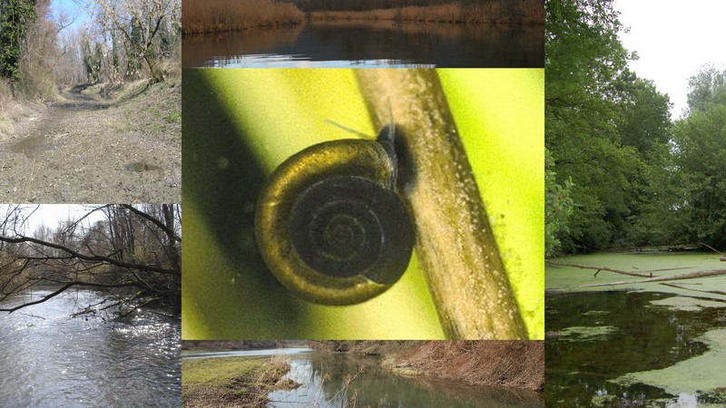
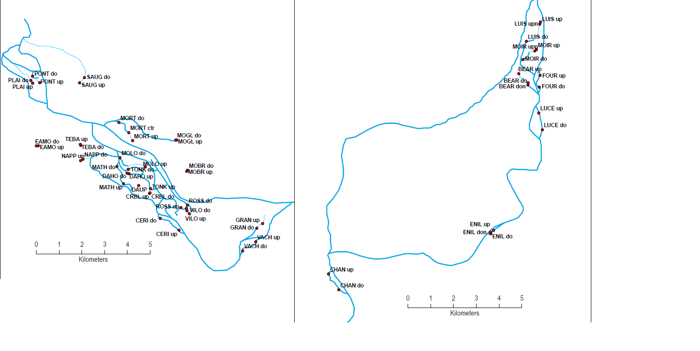

# Project and Data Description

## Study Area

The Upper Rhône River between Geneva and Lyon comprises a number of sectors with relics of the natural floodplain of a braided or meandering river. Like most European floodplains, the natural course of the Rhône has been heavily altered. The remaining channels, isolated by dikes or by natural changes in river morphology offer diverse habitats for freshwater gastropods. These make up an important part of river diversity. The so-called pulse floodplains are in fact the most species rich landscapes for freshwater gastropods. 

The present project is based on data from the monitoring of the Rhône restoration program (e.g., https://onlinelibrary.wiley.com/toc/13652427/2015/60/6, https://doi.org/10.1016/S0925-8574(02)00019-8). Two sectors of the Upper Rhône have been sampled repeatedly before and after restoration. Both sectors are characterized by a power plant installation for which the main flow of the Rhône is diverted. The bypassed sections include some channels of different connectivity with the main river. 

## Samples

Data from 19 cut-off channels can be analyzed, covering fourteen years (biennal sampling for most sites). Some channels are permanently connected and flowing, other channels have just a downstream connection, the last category is not connected at all and is influenced by the river during floods only. 

## Some ideas for the analysis

In a multi-level approach, we can explore different relations between environmental variables and species distribution. Temporal and spatial aspects can be incorporated, as well as the effect of the river restoration.  
